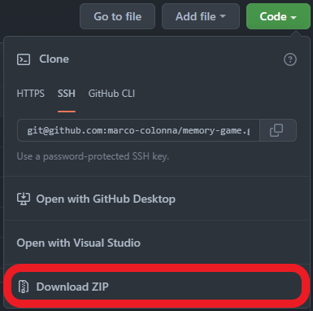
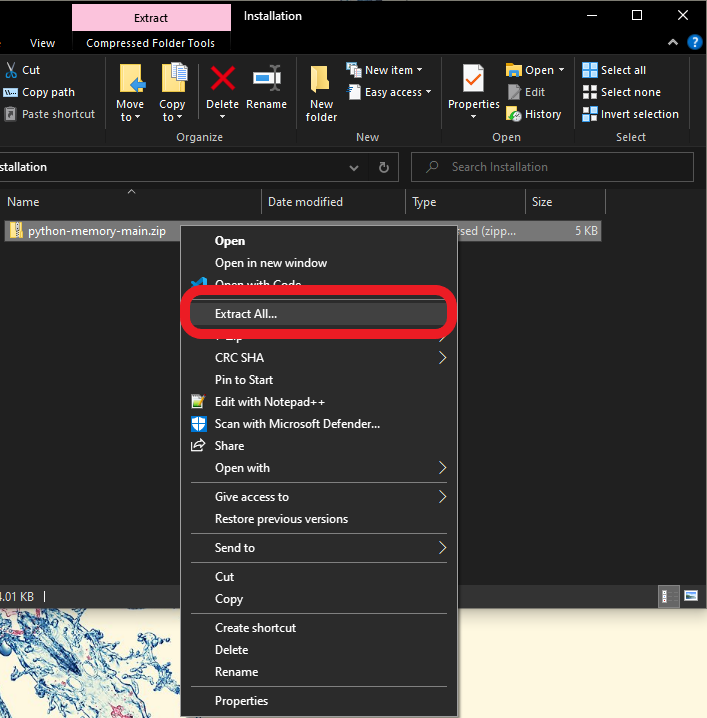
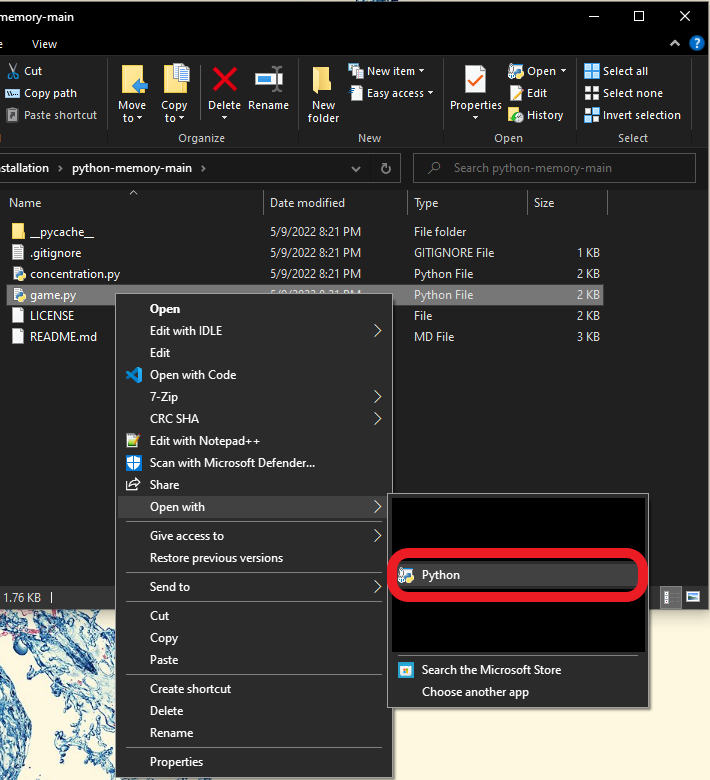

# python-memory - Memory Game

**python-memory is a memory game written in Python, inspired by [memory-game](https://github.com/marco-colonna/memory-game).**

## Description

As stated in the introduction of the game:

```text
Welcome to Concentration!

This is a memory game in which you guess two cards.
If the faces of the cards match, you win the pair
and they remain face up. Don't waste a turn!
```

This program is a replication of my memory game in x86 assembly language, [memory-game](https://github.com/marco-colonna/memory-game), in Python.

## Installation

***Note: python-memory requires an installation of [Python 3](https://www.python.org/) on your device (preferably the latest release).***

This installation will guide you on how to download, open, and run the game on a Windows device.

First, click the green "Code" button located at the top of the repository page.

<p align="center">
    
</p>

Next, click the "Download ZIP" option located at the bottom of the dropdown.

<p align="center">
    
</p>

Download and save the ZIP file to your device, and then unzip (extract) the entire folder.

<p align="center">
    
</p>

Locate the Python file [game.py](game.py).

If you already have Python 3 installed on your device (and Python file associations are already set), then you can open and run the game by double-clicking [game.py](game.py).

If Python file associations are not set, you can open and run the game by right-clicking on [game.py](game.py), selecting "Open with", and selecting Python. If Python is not listed, select "Choose another app" and locate the installation of python.exe on your device.

<p align="center">
    
</p>

You may also be able to open and run the game by opening [game.py](game.py) in an editor, such as IDLE, and running it from the editor.

## Usage

First, the game will display an introduction which includes the welcome screen and an overview of the game.

Enter any number (or any value for that matter), followed by the enter key to continue with the game.

```text
Welcome to Concentration!

This is a memory game in which you guess two cards.
If the faces of the cards match, you win the pair
and they remain face up. Don't waste a turn!

Enter any number to CONTINUE: 5
```

The game will then print the cards, which all begin face-down by default, and prompt you to "guess a card."

```text
■ ■ ■ ■
■ ■ ■ ■
■ ■ ■ ■
■ ■ ■ ■

Guess a card:
```

The cards are labeled 1 to 16, with 1 starting at the top-left corner and continuing left-to-right.

```text
1 2 3 4
5 . . .
```

The game will print the cards again (with your guessed card face-up) and prompt you to guess again.

```markdown
<!-- In this example, the number 1 will be entered as the first guess. -->

Guess a card: 1

☺ ■ ■ ■
■ ■ ■ ■
■ ■ ■ ■
■ ■ ■ ■

Guess a card: 
```

If you make an invalid guess, the game will prompt you to guess again, repeating until you make a valid guess.

A guess is invalid when:

- the guess is non-numeric
- the guess is out of bounds
- the guess has already been chosen or matched

```markdown
<!-- In this example, the number 0 will be entered as an invalid guess. -->

Guess a card: 0

Invalid input. Please try again.

Guess a card:
```

After another valid guess, the game will print the cards a third time. The game will compare the two cards you guessed.

The game will report "match" or "no match," and then a pause in the game will take place.

During this pause, you can choose to either quit or continue the game.

```markdown
<!-- In this example, the number 9 will be entered as the second guess. -->

Guess a card: 9

☺ ■ ■ ■
■ ■ ■ ■
♠ ■ ■ ■
■ ■ ■ ■

No match. :(

Enter 0 to QUIT. Enter any other number to CONTINUE:
```

If you enter 0 during this pause, the game will display a message and end the game.

```markdown
<!-- In this example, the number 0 will be entered during the pause, ending the game. -->

Enter 0 to QUIT. Enter any other number to CONTINUE: 0

Thanks for playing!
```

Otherwise, the game will continue until all the cards are face-up (you have made all the matches).

Good luck! I hope you enjoy the game. **:D**
